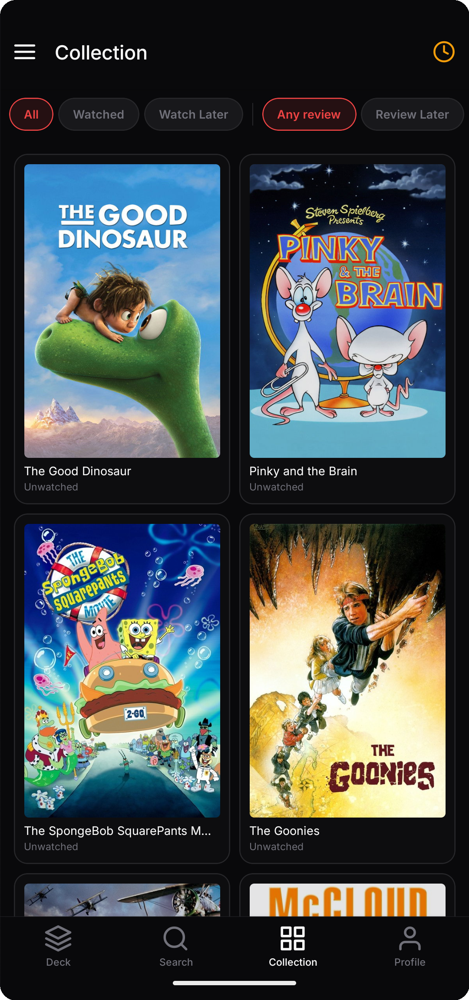
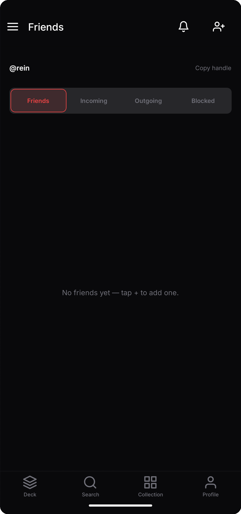
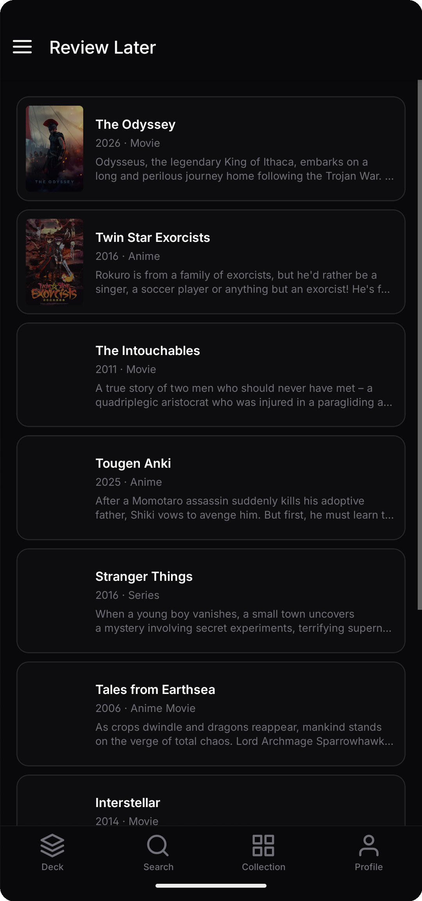
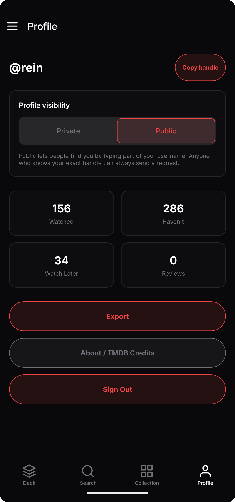

# Mubitracker

A gamified, swipe-based tracker for movies, TV, and anime. Instead of hunting through menus to log what you've watched, Mubitracker feeds you one title at a time in a Tinder-style deck: swipe (or tap) to mark it watched, not interested, save for later, or queue it for a review. Every decision advances the deck immediately, so building out a watch history feels like a quick swiping session instead of data entry.

Beyond the core deck loop, Mubitracker is social — add friends by handle, compare collections, and browse what they're tracking — and reflective, with a dedicated review-later queue for titles you've watched but haven't written up yet, plus a profile view with running stats (watched / haven't / watch-later / reviews) to make progress visible.

## Screenshots

| Deck | Collection | Friends |
|---|---|---|
|  |  |  |

| Review Later | Profile |
|---|---|
|  |  |

## Stack

- **Web:** Next.js 15 + TypeScript
- **Mobile:** Expo (React Native)
- **Backend:** Next.js API routes
- **Database:** PostgreSQL via Supabase
- **Auth:** Supabase Auth

## Getting Started

### Prerequisites

- Node.js 20+
- pnpm 9+
- Supabase project (or local Supabase CLI)
- TMDB API key

### Setup

```bash
pnpm install
cp apps/web/.env.example apps/web/.env.local
# Fill in Supabase and TMDB credentials
pnpm dev
```

### Database

Apply migrations via Supabase dashboard or CLI:

```bash
supabase db push
```

## Monorepo Structure

```text
apps/web       — Next.js web app + API
apps/mobile    — Expo mobile app
packages/shared — Types, schemas, API client
supabase/migrations — PostgreSQL schema
docs/spec      — Product & technical specifications
```

## Documentation

See [docs/spec/](docs/spec/) for full specifications.

## License

Personal project. TMDB data subject to [TMDB API terms](https://www.themoviedb.org/api-terms-of-use).
